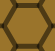
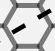
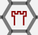
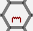
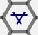
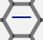
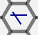
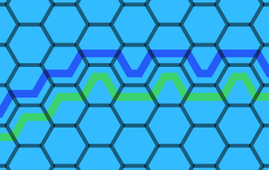

# WorldWar2
This is a strategy game about World War 2 at the global level. There are two scenarios: the 1937 scenario which starts out in 1937 as a war between China and Japan and later European and American countries will also enter the war, and the 1939 scenario where Japan already controls parts of China and Germany enters the war and can invade the country of the Axis player's choice.

The human player decides whether to play as the Axis or the Allies, and a computer player will play as the other partnership.

## Contents
- [Game Sequence](#game-sequence)
- [Victory Conditions](#victory-conditions)
- [War Declaration, Conquest and Liberation](#war-declaration-conquest-and-liberation)
    - [War Declaration](#war-declaration)
    - [Other Ways of Entering the War](#other-ways-of-entering-the-war)
    - [Japanese/Soviet Relations](#japanesesoviet-relations)
    - [Conquest](#conquest)
    - [Liberation](#liberation)
    - [Chinese Exceptions](#chinese-exceptions)
    - [Colonies and Conquest](#colonies-and-conquest)
    - [Vichy France](#vichy-france)
    - [Italian Surrender](#italian-surrender)
    - [Finnish Surrender](#finnish-surrender)
    - [Atomic Bomb](#atomic-bomb)
- [Units](#units)
    - [Types of Units](#types-of-units)
        - [Land Units](#land-units)
        - [Naval Units](#naval-units)
        - [Air Units](#air-units)
    - [Buying Units](#buying-units)
    - [Strength Points](#strength-points)
    - [Buying Back Eliminated Units](#buying-back-eliminated-units)
    - [New Available Units](#new-available-units)
- [Combat](#combat)
    - [Land Combat](#land-combat)
        - [Overrun](#overrun)
        - [Supply Units in Combat](#supply-units-in-combat)
    - [Naval and Air Combat](#naval-and-air-combat)
        - [Interception](#interception)
        - [Damaged Units](#damaged-units)
        - [Kamikaze](#kamikaze)
    - [Bombing](#bombing)
- [Amphibious Assaults and Paradrops](#amphibious-assaults-and-paradrops)
- [Supply](#supply)
    - [Supply Sources](#supply-sources)
    - [Effects](#effects)
- [Terrain](#terrain)
- [Weather](#weather)
    - [Weather Zones](#weather-zones)
    - [Weather Conditions](#weather-conditions)
        - [Severe Winter](#severe-winter)
        - [Mild Winter](#mild-winter)
        - [Spring](#spring)
        - [Monsoon](#monsoon)
- [Money](#money)
    - [Money Exchange](#money-exchange)
    - [Convoys](#convoys)

## Game Sequence
The game sequence consists of the following phases:

- **War declaration phase**: During this phase, each player decides which neutral countries they want to invade, if any. Countries are also conquered and liberated during this phase when applicable.
- **Deployment phase**: During this phase, each player deploys the units they bought during last turn's unit build phase. Countries that have just entered the war deploy their initial units. Fortifications and airfields can also be built during this phase. Units are deployed simultaneously, so none of the two players know where the other player is placing their units until the end of this phase.
- **Income phase**: During this phase, each country at war receives income proportional to the numer of resource hexes it controls. Countries of the same partnership can also exchange money with each other.
- **Unit build phase**: During this phase, each country can buy units and repair damaged units.
- **Main phase**: This phase is run twice, first for the Axis player then for the Allied player. It consists of the following subphases:
    - **Overrun phase**: During this phase, armor units can do overrun attacks if the weather permits it.
    - **First movement phase**: During this phase, units can move up to their full movement allowance. Be careful of how far you move air units though, as they have to have enough movement points to return to their base during the second movement phase.
    - **Interception phase**: During this phase, air units can intercept naval units and other air units. The opponent starts by intercepting the player's units that have moved in the first movement phase. Then each player takes turns to intercept units that have moved during the interception phase. When all interceptions have been declared, interception combat takes place, where there's a possibility that the defender's mission is canceled.
    - **Amphibious and paradrop phase**: During this phase, land units embarked on naval units and paratroopers embarked on air units can do amphibious assaults and paradrops into enemy controlled hexes.
    - **Combat phase**: During this phase, the player in turn can choose to attack enemy units.
    - **Second movement phase**: During this phase, air units of both partnerships must return to their bases using movement points that haven't been used in the first movement phase. Friendly land units that haven't moved during the first movement phase or attacked can move, either normally or by rail. (exception: armor units that haven't moved in the first movement phase can always move even if they've attacked). Naval units can move their full movement allowance regardless of whether they've previously moved or attacked.
- **Supply phase**: During this phase, land units that are out of supply lose half their strength, rounded up. Supply is checked for armor units and air units, and naval units outside of ports lose one month's supply.

## Victory Conditions
The Allied player wins at the end of any war declaration phase where all Axis countries are conquered.

The Axis player wins at the end of any war declaration phase where the following conditions hold simultaneously:
- All Allied countries are conquered.
- The United States is conquered.
- The Soviet Union is either conquered or friendly to the Axis.

## War Declaration, Conquest and Liberation
### War Declaration
During the war declaration phase, a player may declare war on one or several neutral countries. When that happens, the neutral country in question receives some units for free and joins the player's opponent.

Declaring war on the following neutral countries also has the following effects:
- Declaring war on any one of the **United Kingdom**, non-Vichy **France**, **Canada**, **Australia** or **New Zealand** also declares war on the four others.
- If the Axis declares war on any of **Poland**, **Denmark**, **Norway**, **Sweden**, **Belgium**, **Romania**, **Yugoslavia**, **Greece**, **Estonia**, **Latvia** or **Lithuania**, they automatically also declare war on the five countries listed above.
- Declaring war on the **United States** or **Panama** also declares war on the other one.
- Declaring war on **Mongolia** also declares war on the Soviet Union. In addition, if the Soviet Union is part of the Allies and Mongolia is at war, Japan and the Soviet Union can attack each other.
- Declaring war on **Hungary** or **Bulgaria** also declares war on Germany.
- If the Axis declares war on **Poland** while the Soviet Union is neutral and Germany is part of the Axis, the Soviet Union gains control of every hex to the east of the temporary border in Poland, and every hex in neutral territory in Estonia, Latvia, Lithuania, to the east of the temporary border in Romania and to the east of the southern temporary border in Finland (the northern temporary border in Finland has no effect for now). Units may not enter these hexes without first declaring war on the Soviet Union.
- Whenever a player declares war on the **Soviet Union**, Finland enters the war on that player's side.

The Allies may not declare war on the following countries:
- The United Kingdom, non-Vichy France, Canada, Australia, New Zealand
- The United States or Panama
- Poland
- China
- In addition, as long as China is the only Allied country at war that has land units, the Allies may not declare war on any country that doesn't share a land border with China.

The Axis may not declare war on the following countries:
- Germany
- Italy
- Hungary
- Bulgaria
- Thailand
- Japan

The player who controls the Soviet Union may not declare war on Mongolia.

No player may declare war on Finland, instead Finland enters the war on the side opposing the Soviet Union.

### Other Ways of Entering the War
Other than being declared war, certain countries can also enter the war in other ways:
- **Japan** and **China** have already entered the war at the beginning of the game.
- If the Allies have not already declared war on it, **Germany** automatically enters the war on the side of the Axis during the war declaration phase of August 1939.
- The Axis may have **Thailand** enter the war on their side during any war declaration phase where Japan has at least one land unit in a hex adjacent to Thailand.
- If Germany is at war and not conquered, the Axis may have **Italy** enter the war on their side during any war declaration phase they wish.
- If Germany or Italy is at war and not conquered, the Axis may once in the game attempt to have **Spain** enter the war on their side, with a 25% chance of succeeding.
- The Axis may have **Hungary** enter the war on their side during any war declaration phase where Germany has at least one land unit in Yugoslavia.
- The Axis may have **Bulgaria** enter the war on their side during any war declaration phase where Germany has at least one land unit in Yugoslavia or Greece.
- If the Soviet Union is an Allied partner (conquered or not), the Axis may have **Romania** enter the war on their side during any war declaration phase where Germany has at least one land unit in the Soviet Union.
- If any of the Soviet Union, Hungary or Bulgaria is an Axis partner (conquered or not), the Allies may have **Romania** enter the war on their side during any war declaration phase where the United Kingdom has at least one land unit in that country.
- As long as the Soviet Union is an unconquered Axis partner, the Axis player may have **Mongolia** enter the war on their side during any war declaration phase they wish.
- As long as the Soviet Union is an unconquered Allied partner, the Allied player may have **Mongolia** enter the war on their side during any war declaration phase where Germany is conquered.
- As long as the Soviet Union is *not* an unconquered Axis partner, the Axis may have **Afghanistan** enter the war on their side during any war declaration phase where the Axis controls at least one of Karachi, Urumchi, Ashkhabad or Tashkent.

### Japanese/Soviet Relations
As long as Mongolia is neutral and Japan and the Soviet Union are members of opposing partnerships, Japanese units may not enter or attack into the Soviet Union, and Soviet units may not enter or attack into Japan or its colonies. They may however attack each other's units in third party countries. When Mongolia enters the war, this restriction is lifted and Japan and the Soviet Union are considered each other's enemies just like any other two countries of opposing partnerships.

### Conquest
A country is considered conquered during any war declaration phase where all the cities in the country are controlled by that country's enemy. For this purpose, Poland and the Soviet Union are always considered each others' enemies, even when they both belong to the same partnership.

When a country is conquered, all that country's units are eliminated, the country loses all its money and does not receive any more money for as long as it's conquered, and it may not buy any units for as long as it's conquered. The conquerer's partership gains control of all the remaining hexes in the country (except those occupied by a land unit enemy to the conquerer).

### Liberation
A conquered country is considered liberated during any war declaration phas where that country's partnership controls all cities in the country. When a country is considered liberated, that country gets 5 infantry strength points for free that can be put on the map during the next deployment phase (exception: Denmark, which only had 3 strength points before it was conquered, only receives 3 strength points when it's liberated, and China can buy back all the infantry units that it had when it was conquered). Countries that never had infantry units won't receive any liberated forces. The country will not receive any additional units available for build after this, even if those units would normally be scheduled. The country receives its income every month as usual as long as it doesn't get conquered again. If the liberated forces get eliminated, the liberated country can buy them back normally.

A liberated country can become conquered again as usual, with the same effects as a normal conquest.

Italy can never be liberated, and neither can any country which was conquered using atomic bombs.

### Chinese Exceptions
There are a few exceptions to the rules above if China is conquered or liberated:

- When China is conquered, hexes in China under Chinese control remain under Chinese control, the conquerer does not gain control of any hexes in China that it wouldn't have controlled anyway.
- For China to be liberated, it's enough that the Allies control one Chinese city, they don't need to control all of them.
- When China is liberated, China receives 5 infantry strength points for free just like any other country, but can also buy all units that it had on the map or available for build when it was conquered. Just like any other liberated country, China will not receive any additional units available for build after this, even if those units would normally be scheduled.
- The rule that China controls every hex in China unless that hex is occupied by an Axis land unit still applies when China is conquered. In particular, this means that if there are no Axis land units in a Chinese city, China gains control of that city and becomes liberated during the next war declaration phase (unless the Axis captures that city again before then or if China has surrendered due to atomic bombs).

### Colonies and Conquest
When a country with colonies is conquered, what happens to the colonies depends on the country:
- The **United Kingdom**, **Spain**, **Portugal**, the **Netherlands**, **Japan** and the **United States** are only considered conquered if all cities in both the mainland country and all its colonies are under enemy control.
- **France** can be conquered using Vichy France (see below). If the Axis fails or does not attempt to create Vichy France, France is only considered conquered if all cities in both France and all its colonies are under enemy control.
- For **Belgium** to be conquered, only Antwerp and Brussels need to be captured by Belgium's enemy. When this happens, the United Kingdom gains control of Belgian Congo. When Belgium is liberated, Belgium gains control of Belgian Congo again.
- For **Denmark** to be conquered, only Esbjerg, Aalborg and Copenhagen need to be captured by Denmark's enemy. When this happens, the United Kingdom gains control of Iceland and the Faroe Islands, and the United States gains control of Greenland. If the United States is still neutral when this happens, any unit in Greenland is removed from the map and returned during the next deployment phase for free, and Greenland becomes neutral territory and no country can invade Greenland without first declaring war on the United States. When Denmark is liberated, Denmark gains control of its colonies again, and units may be sent to Greenland as normal even if the United States is still neutral.
- **Italy** surrenders before it would be conquered normally, see below.

### Vichy France
If Paris is captured by the Axis either within two years of France entering the war, the Axis player may choose to attempt to create Vichy France, with a 75% chance of succeeding. If the attempt failed, the Axis player may never attempt to create Vichy France again in the game.

When Vichy France is created, Germany gains control of all hexes in France north of the temporary border, Japan gains control of all hexes in French Indochina, the United Kingdom gains control of Lebanon-Syria, French Cameroon, French Equatorial Africa and French islands in the Pacific, France gains control of all other hexes in France and its colonies, and the United Kingdom gains control of all hexes that France controlled outside of French territory. Vichy France is treated as a neutral country which either player can declare war on. All non-French units in Vichy French territory are removed from the map and returned during the next deployment phase for free.

If the Allies gain control of all hexes in mainland France north of the temporary border while Vichy France is still neutral, France is considered liberated and Vichy France joins the Allies.

If the Allies declare war on Vichy France, France becomes part of the Axis, and the Axis gains control of all hexes belonging to Vichy France. The Allies may later conquer France if the criteria are met, and the Axis may then liberate France if those criteria are met. However, if the Axis liberates France, France receives no liberated forces.

### Italian Surrender
If the Allies control a city on the Italian mainland as well as all cities in the Italian colonies in Africa (Tripoli, Benghazi, Addis Ababa and Mogadishu), or if the Allies control all cities on the Italian mainland, Italy is considered conquered and can never be liberated.

When Italy surrenders, Germany gains control of all hexes Italy controlled in mainland Italy, Sicily, Sardinia and Albania, and the United Kingdom gains control of all hexes Italy controlled in Libya and Italian East Africa.

### Finnish Surrender
If during any war declaration phase the Soviet Union has at least 20 supplied strength points in Finland and controls at least one city in Poland west of the temporary border or in Germany, the Soviet player may have Finland surrender.

When Finland surrenders, Finland becomes neutral and gains control of all hexes in Finland west of the temporary borders. The Soviet Union gains control of all Hexes in Finland east of both temporary borders and all hexes Finland controlled outside of Finland. All naval units, air units and Soviet land units in Finland are removed from the map and returned during the next deployment phase for free. All non-Soviet land units in Finland are eliminated and can be bought back during a subsequent unit build phase, this represents the Lapland war.

No player may ever declare war on Finland again in the game, and no unit may enter any hex in Finland to the west of the temporary borders. The hexes in Finland to the east of the temporary borders are considered Soviet territory and may be entered normally.

### Atomic Bomb
The following countries can use atomic bombs after and including the following turns with the following air units:
- **United States**: August 1945, B-29 Superfortress
- **Japan**: October 1946, Ki-48-IIc
- **Germany**: June 1947, HE-177
- **Soviet Union**: September 1949, Tu-2
- **United Kingdom**: November 1952, Lancaster

Dropping an atomic bomb in a hex has the following effects:
- Land units, based air units, and naval units in a port are elimniated and can't be bought back.
- If the hex is a city or resource hex, the city and the resource hex are destroyed and can't be repaired. This means that it's no longer considered a port, the city and the resource hex don't contribute to airbase capacity, and the hex's controller doesn't get any money for it. Fortifications and airfields are also destroyed, but new fortifications and airfields can be built in the hex normally.
- If the atomic bomb is not dropped in a colony, the country in which it is dropped has a certain probability of surrendering. For most countries, the initial probability of surrendering is 50%, except for Italy and France for which it's 75%, and for Japan and China for which it's 30%. If the country does not surrender on the first atomic bomb, this probability is increased for each atomic bomb that has been dropped on the country previously. This probability is also higher if the country's enemy controls a city within the country (not including colonies).

If a country surrenders due to an atomic bomb, it can't be liberated.

## Units
### Types of Units
There are three basic types of units in the game: land units, air units and naval units.

#### Land Units
Land units have two numbers: strength (lower left corner) and movement allowance (lower right corner). For example, the below unit has a strength of 5 and a movement allowance of 3:

Land units have five subtypes:
- **Infantry**: These are the most basic types of land units, with no special abilities. They're cheaper than other types of land units.
- **Armor**: Armor units have several special abilities:
    - Armor units have a higher movement allowance than other land units.
    - Armor units typically have a larger maximal strength than other land units (the details depend on the country owning the units, see below).
    - Armor units can do overrun attacks if the weather doesn't prohibit it.
    - Armor units can move an extra space through enemy control zones.
    - Armor units can move in the second movement phase even though they've attacked.
    - Armor units don't become out of supply immediately if they can't trace a supply line, instead they're not out of supply until the next supply phase.
- **Paratrooper**: These are the only units that can do paradrops.
- **Marine**: If a marine participates in an amphibious assault, the amphibious assault has a higher chance of succeeding. However, unlike paratroopers and paradrops, non-marine units may also participate in amphibious assaults.
- **Supply unit**: These units can be used as portable supply sources in cases where it's not possible to trace overland supply lines (for example islands or amphibious assaults). Supply units have strength 0 and can't attack.

The symbol in the middle of the unit is a [NATO joint military symbology](https://en.wikipedia.org/wiki/NATO_Joint_Military_Symbology) symbol and indicates both the type and the partnership of the unit. Units owned by the human player have their symbol in the shape of a rectangle (friendly), units owned by the computer player have their symbol in the shape of a diamond (hostile), and neutral units have their symbol in the shape of a square.

#### Naval Units
Naval units have four numbers: surface attack (upper left corner), attack against submarines (lower left corner), defense (upper right corner) and movement allowance (lower right corner). For example, the below unit has a surface attack of 3, an attack against submarines of 1, a defense of 3 and a movement allowance of 52:

Special types of naval units that can't attack have a letter instead of their surface attack: "T" indicates a transport ship, "C" indicates a carrier, and "$" indicates a convoy.

There are multiple types of naval units:
- **Battlecruiser**, **Battleship**, **Destroyer escort**, **Destroyer**, **Heavy cruiser**, **Kaibokan**, **Light cruiser**: These are the most basic types of naval units, which can attack normally and have no other special abilities. The only functional difference between these types is how much they cost, and some of these types are typically stronger than others.
- **Submarine**: Submarines have several special abilities:
    - When another unit attacks submarines, their submarine attack strength (lower left corner) is counted instead of their surface attack strength (upper left corner).
    - Submarines can move an extra space through enemy control zones.
    - Submarines can't be intercepted (though they can be attacked by air units in the combat phase).
- **Carrier**: Carrier-based air units (which have a "C" next to their movement allowance) can embark onto carriers instead of basing at a regular airbase. Each carrier can hold one air unit. It's not possible to land on damaged carriers (though it's possible to take off from them), so if a carrier gets damaged it's a good idea to repair it as soon as possible. Carriers themselves can't attack.
- **Transport ship**: Transport ships are used to transport land units over sea and to do amphibious assaults. Each transport ship can hold one land unit regardless of strength. It's not possible to embark units onto damaged transport ships (though it's possible to disembark them).
- **Convoy**: Convoys are used to exchange money between countries that are overseas from each other.

Submarines are recognized by having an image of a sumbarine instead of a regular ship. Transport ships and convoys are recognized by having a "T" or "$" instead of a surface attack strength. Carriers can be recognized both by having a "C" instead of a surface attack strength, and by having an image of a carrier instead of a regular ship.

#### Air units
Air units have four numbers: fighter strength (upper left corner), bomber strength (lower left corner), defense (upper right corner) and movement allowance (lower right corner). For example, the below unit has a fighter strength of 1, a bomber strength of 3, a defense of 2 and a movement allowance of 12.

Since there are no air units that are both fighters and transport units, transport air units have a "T" instead of their fighter strength. Carrier based air units have a "C" next to their movement allowance. Kamikaze-only bombers have a "K" next to their bomber strength.

There are three basic types of air units:
- **Figher**: These units can attack and intercept other air units. These units have a non-zero fighter strength (upper left corner).
- **Bomber**: These units can attack and intercept naval units, as well as bomb installations and support land attacks. These units have a non-zero bomber strength (lower left corner).
- **Transport air unit**: These units can be used to transport land units of strength 0 or 1. If the transported unit is a paratrooper, it can do a paradrop. These units have a "T" in the upper left corner.

In addition, there are two mixed types of air units:
- **Fighter-bomber**: These units can be used both as fighters and as bombers. Their fighter strength (upper left corner) is used against air units and their bomber strength (lower left corner) is used against naval units, installations and land units.
- **Bomber-transport**: Italy has SM-79 Sparveiro units which are transport air units with a non-zero bomber strength. These units can be used as regular bombers as well as transport land units. A land unit being embarked on a bomber-transport unit doesn't prevent it from being used as a bomber.

Transport air units are recongized by having a "T" instead of a fighter strength. Fighters are recognized by having a non-zero fighter strength, and bombers are recognized by having a non-zero bomber strength.

### Buying Units
Units can be bought during the unit build phase, and arrive during a subsequent deployment phase. Each type of unit has its own cost and its own delay between the unit build phase where it's bought and the deployment phase where it arrives:

| Type of unit                              | Cost   | Delay     |
|-------------------------------------------|--------|-----------|
| 1 infantry strength point                 | $100B  | 1 month   |
| 1 armor strength point                    | $200B  | 3 months  |
| 1 marine strength point                   | $200B  | 3 months  |
| Paratrooper                               | $300B  | 3 months  |
| Supply unit                               | Free   | 1 month   |
| Figher or fighter-bomber                  | $800B  | 4 months  |
| Bomber or bomber-transport                | $600B  | 4 months  |
| Transport air unit                        | $300B  | 2 months  |
| Carrier (includes carrier-based air unit) | $1400B | 12 months |
| Convoy                                    | $50B   | 2 months  |
| Destroyer escort                          | $400B  | 3 months  |
| Destroyer                                 | $500B  | 6 months  |
| Kaibokan                                  | $150B  | 3 months  |
| Light cruiser                             | $200B  | 6 months  |
| Submarine                                 | $500B  | 6 months  |
| Transport ship                            | $400B  | 2 months  |
| Battlecruiser, battleship, heavy cruiser  | $1400B | 12 months |

### Strength Points
Each land unit consists of a certain number of strength points. Land units are bought one strength point at a time. When deploying the land units, several strength points can be combined into one unit. During combat, the number of strength points in a given unit can be reduced due to combat losses. During the deployment phase, it's also possible to combine several small units into one large unit (as long as they're in the same hex and have the same type and nationality), or to split up a large unit into two smaller units.

The maximum number of strength points that can be combined into the same unit depends on the unit's type and nationality:

| Owner          | Infantry/Marine          | Armor                      | Paratrooper | Supply unit |
|----------------|--------------------------|----------------------------|-------------|-------------|
| China          | 3                        | -                          | -           | -           |
| France         | 6                        | 8                          | -           | 0           |
| Germany        | 8 (movement allowance 3), 5 (movement allowance 2) | 10 (<1943), 12 (&geq;1943) | 1           | 0           |
| Soviet Union   | 5 (<1943), 6 (&geq;1943) | 8                          | 1           | 0           |
| United Kingdom | 6 (<1943), 8 (&geq;1943) | 8 (<1943), 10 (&geq;1943)  | 1           | 0           |
| United States  | 8                        | 12                         | 1           | 0           |
| Other          | 5                        | 8                          | 1           | 0           |

### Buying Back Eliminated Units
When a land unit is eliminated or loses strength points, those strength points can always be bought back in a subsequent unit build phase.

Naval units that are eliminated can only be bought back if they were in a port at the time they were eliminated (exception: convoys and transport ships can always be bought back).

Air units that are eliminated can only be bought back if they were based at the time they were eliminated.

Note that none of this applies to units that are removed from the map when their owner is conquered. Conquered countries can't buy units, and once they're liberated they can only buy a limited number of infantry units. See [Conquest](#conquest) and [Liberation](#liberation) for more details.

### New Available Units
Some countries regularly receive new units that can be bought:
- **Australia** receives two destroyers in June 1940, and one fighter air unit each in January 1942 and June 1943.
- **Canada** receives destroyers, destroyer escorts, and light cruisers regularly starting in 1943, as well as two destroyers in March 1940.
- **China** receives two infantry strength points every month in 1937, 1938 and 1943, as well as one bomber air unit 12 months after the United States enters the war and one bomber air unit 24 months after the United States enters the war.
- **France** receives two infantry strength points each month and 2 armor strength points every other month (every month starting a year after they entered the war). They also receive new air units throughout 1940, one carrier in June 1940, and one carrier in June 1942 (these aircraft carriers were never completed in real life).
- **Germany** regularly receives land units throughout the game, and air and naval units until 1944. Starting 1943, the new infantry units that Germany receives have movement allowance 2 and max strength 5 instead of movement allowance 3 and max strength 8 (existing units are unaffected by this, including those that haven't been bought yet).
- **Italy** receives one new infantry strength point every other month, and, starting 1939, one armor strength point every other month. Prior to 1944, it also receives naval and air units regularly. These units come at a fixed schedule regardless of when Italy enters the war, even if Italy is neutral.
- **Japan** regularly receives land units throughout the game, air units until 1945, and naval units until 1946. The units arriving in 1946 were planned but never built in real life.
- The **Netherlands** receives a submarine in January 1940 and a bomber in January 1941. These arrive at a fixed schedule regardless of when the Netherlands enter the war, even if the Netherlands is neutral.
- The **Soviet Union** regularly receives land and air units once it's entered the war, where each unit it scheduled to enter a certain number of months after the Soviet Union enters the war. The Soviet Union also receives a small number of land and naval units at a fixed schedule.
- **Sweden** receives two infantry strength points every month starting when Norway or Sweden enters the war until 15 months after that date, as well as one destroyer each 2 and 3 years after Norway or Sweden enters the war. If Norway enters the war but not Sweden, Sweden receives these units while it's neutral, making it more difficult to attack Sweden long after Norway has entered the war.
- The **United Kingdom** receives naval and air units at a fixed schedule. Once it's entered the war, it receives one armor strength point and two infantry strength points each turn. Once the United States has also entered the war, this is increased to one armor strength point and four infantry strength points each turn.
- The **United States** regularly receives land units and submarines, carriers and destroyers once it's entered the war. It also receives air and naval unis at a fixed schedule.

## Combat
### Land Combat
During the combat phase, land units may attack each other. The attackers and defenders must be adjacent to each other, and the hex that seperates them may not be an all sea hexside. Both the attackers and defenders can have their strengths modified by [terrain](#terrain) and [weather](#weather-conditions). Land units can only be attacked by stack, it is not possible to attack individual enemy units without attacking the rest of the stack. It is however possible to only use individual friendly units as attackers without using the whole stack.

The attackers may receive support from bomber and non-submarine naval units in the defender's hex, though naval and air units may not attack land units alone. Bombers add their full bomber strength to the land units' strength points, and naval units contribute one fifth of their surface attack strength.

The combat results are random and depend on the combat ratio (the attacker strength divided by the defender strength). The combat can have the following effects:
- The defender can lose strength points. The probability for losing a certain amount of strength points is an exponential function of the combat ratio, which means that attacking an enemy stack of land units with all adjacent friendly units at once has the same probability of success as attacking the enemy stack in multiple combats with a limited number of friendly attackers at a time. If the losses are greater than the number of strength points in the defending stack, the defender is eliminated.
- The defender chooses prior to combat whether or not they're willing to retreat. If they are not willing to retreat, the losses from the above point are doubled. If they are willing to retreat, they retreat only if the losses are non-zero (otherwise they are unaffected by the attack). When units retreat, they retreat one hex, and the destination hex must either be free from enemy control zones or contain a friendly land unit. Units must also obey stacking limits when retreating. If it's not possible for all defenders to retreat within these conditions, the losses are doulbed as if the defender were unwilling to retreat.
- There can also be losses for the attacker. If the combat ratio is greater than or equal to 1 (i.e. the modified attack strength is greater than or equal to the modified defense strength), there is a 50% risk of attacker losses, and the attacker can lose up to 3 strength points. This is not affected by the combat ratio. For combat ratios less than 1, there is additionally a risk of the attacker being eliminated entirely, and this risk increases as the combat ratio decreases.

#### Overrun
Overruns are special land attacks that take place during the overrun phase rather than the combat phase. Only armor units may attack in overrun attacks (they can't even receive support from naval or air units), though they may attack any types of enemy land units. If the defenders lost at least one strength point in an overrun attack, the attacking armor units may ignore control zones when moving in the subsequent movement phase.

#### Supply Units in Combat
Supply units are special land units because they are the only units that have zero strength. This means that they have the following special rules in combat:
- Supply units can't attack.
- If a stack containing both supply units and other land units is attacked, the supply units don't contribute to the defending strength. If the stack is forced to retreat, so is the supply unit. The supply unit is eliminated if and only if the entire stack is eliminated.
- If a stack containing only supply units is attacked, the supply units are always eliminated, and there will never be losses for the attacker.

### Naval and Air Combat
The following types of naval and air combat may occur during the combat phase:
- Naval units may attack enemy naval units in adjacent hexes. Naval units may not attack across all land hexsides or canals (even if the canal is controlled by the attacking player).
- Bomber air units may attack enemy naval units in the same hex.
- Fighter air units may attack enemy air units in the same hex.

When a naval or air combat takes place, the attacker and defender both attack each other with the same odds. This means that if an air unit attacks another air unit with the same fighter strength and defense strength, the attacker and defender have the same probability of being eliminated or damaged, and the same applies to naval units. If the defender couldn't attack the attacker, there is no risk for losses for the attacker. This can be the case if an air unit attacks a naval unit, a fighter attacks a non-fighter air unit, if a submarine attacks a naval unit with zero submarine attack strength, or if a naval unit attacks a carrier, transport ship or convoy.

Enemy air units can be attacked individually, but enemy naval units must be attacked by stack. This means that if a submarine attacks a stack where only some defeners have a non-zero submarine attack strength, there can still be losses for the submarine, and the same applies if a naval unit attacks a stack containing both transport ships/carriers/convoys but also regular war ships.

Losses are inflicted onto each defender individually, and defenders with a large defense strength have a higher chance of surviving than defenders with a small defense strength. The number of units participating in combat on each side is also important, a unit that participates in combat together with other units has a higher chance of surviving than if the same unit were to participate in the same combat alone.

When naval units attack other naval units, the defenders have a certain probability of retreating. Naval retreats obey similar rules to land retreats, i.e. the retreating units retreat one hex, must obey stacking limits, must end in a hex free from naval control zones unless there is a friendly naval unit in that hex (land units and land control zones don't affect naval retreats). However, unlike land retreats, if no naval retreat is possible, the defender simply remains in the combat hex without any additional damage. This means that there is no possibility to refuse to retreat for naval units.

#### Interception
Interception is a special kind of air-naval combat that occurs during the interception phase. Fighters can intercept enemy air units, and bombers can intercept enemy naval units. Only air units can intercept other units.

Interceptions have the same effect as regular attacks, but additionally there's a certain probability (that increases with the combat ratio) that the defender's mission is canceled. If that happens, the defender is moved back to the hex that it started the first movement phase in, and the if the defender was itself going to do an interception, that interception doesn't take place.

Interceptions can occur in any hex that the defender passed during the first movement phase. If the defender's mission isn't canceled, the defender continues the the next hex where it would be intercepted. If there are no more interceptions against that defender, the defender continues the the hex it attempted to go to during the first movement phase.

Unlike regular combat against naval units, interception attacks are always against one unit at a time.

#### Damaged Units
Both naval and air units can be damaged as a combat result. A unit being damaged has the following effects:
- Damaged units have their attack and defense strengths halved in subsequent combats.
- If a damaged unit were to be damaged again, that unit is eliminated.
- Units can't embark onto damaged carriers, transport ships or transport air units. They can however disembark from these units. Units that are embarked on a unit that gets damaged are unaffected by the damage (though units embarked on a unit that gets eliminated are eliminated as well).

During the deployment phase, damaged naval and air units can be repaired at a cost of $200B. Naval units must be in a port to be repaired, and there is no restriction on which air units can be repaired (since all air units are always based during the deployment phase). Damaged air units based on carriers can be repaired even if the carrier isn't in a port.

The following units can't be damaged and are eliminated directly if they would have been damaged:
- Convoys
- "ME-262" German fighter air units
- "MXY-7 Ohka" Japanese kamikaze air units

#### Kamikaze
Kamikaze attacks are a special kind of air-naval attacks that can only be used by Japanese bombers against Allied naval units, and only if the Allies control at least one city hex in Japan or its colonies (historically this city hex was Saipan).

When a Japanese bomber unit attacks Allied naval units, the Axis player can choose if those attacks are kamikaze attacks. If they are, the attack strength of the bomber unit is tripled, but the bomber will always be eliminated.

Air units with a "K" next to their bomber strength can only be used in kamikaze attacks. They can't do regular attacks against naval units, they can't bomb installations, and they can't support land comat.

### Bombing
Bombers can also bomb installations and do strategic bombing against resource hexes.

If installation bombing succeeds against a city or resource hex, the city/resource hex doesn't contribute to airbase capacity and can't be used as a port. If installation bombing succeeds against an airfield or fortification, that installation is destroyed.

If strategic bombing succeeds against a resource hex, that resource hex doesn't contribute to its controller's income.

Cities and resource hexes that are damaged by bombing can be repaired for $200B during the deployment phase. If the hex is damaged by both installation bombing and strategic bombing, the $200B can be paid to repair both damages at once. Fortifications and airfield installations can't be repaired this way, they must be built again from scratch.

Some countries can also get atomic boms, see [Atomic Bomb](#atomic-bomb) for details.

## Amphibious Assaults and Paradrops
During the amphibious and paradrop phase, land units embarked on naval units can do amphibious assaults, and paratroopers embarked on air units can do paradrops. Only paratroopers can do paradrops, but any land unit can do amphibious assaults (though marines have a higher chance of succeeding).

Combining amphibious assaults and paradrops increases the success probability, as well as using marines for amphibious assaults:

| Success probability      | Combined amphibious assault and paradrop | Only amphibious assault/Only paradrop |
|--------------------------|------------------------------------------|---------------------------------------|
| Marines participating    | 100%                                     | 75%                                   |
| No marines participating | 75%                                      | 50%                                   |

If the assault fails, all participating land units are eliminated.

If the assault succeeds and there are no enemy land units in the hex, all participating land units are placed in the hex and their controller immediately gains control of the hex. Participating land units may not attack during the combat phase this turn, and may not move during the second movement phase unless they're armor units.

If the assault succeeds but there are enemy land units in the hex, all participating land units are placed in the hex, but the controller of the hex doesn't change. During the subsequent combat phase, the assaulting land units must attack the enemy units in their hex (they may not attack units in adjacent hexes). If the hex is free from enemy land units after the attack, the owner of the assaulting units gains control of the hex, and the assaulting units function normally afterwards. If there are still enemy land units in the hex at the end of the combat phase, all assaulting land units are eliminated and the assault is considered to have failed (even if it initially succeeded during the amphibious/paradrop phase).

Only as many units as could stack in the hex may participate in an amphibious assault or paradrop.

## Supply
A unit must be in supply to attack. What units are in supply depends on the type of unit:
- Infantry, paratrooper and marine units are out of supply when they can't trace a supply line to a friendly supply source.
- Armor and supply units are out of supply when they can't trace a supply line to a friendly supply source if they haven't been able to do so since the last supply phase.
- Air units are out of supply if they haven't been on a base where they were able to trace a supply line to a friendly supply source since the last supply phase.
- Naval units are out of supply if they haven't been on a base where they were able to trace a supply line to a friendly supply source for the past three months.
- Embarked units are in supply whenever the unit they're embarked on is in supply.

A supply line is a line of hexes of any length from a unit to a supply source. Each hex in a supply line must be free from enemy units and controlled by a friendly country (though they don't have to be located in a friendly country), and may only be located in an enemy control zone if the hex contains friendly land units.

### Supply Sources
There are three types of supply sources:
- City resource hexes located in a friendly country and controlled by a friendly country are the main supply sources.
- Supply units can be used as supply sources for non-supply units. This is useful for example on islands where it's not possible to trace supply lines to friendly city resource hexes. Supply units don't have to be in supply themselves to be useable as supply sources, but supply units that have been out of supply for an entire turn are eliminated during the supply phase, so they need to be replaced regularly. Note that supply units are free, so them being eliminated isn't necessarily a bad thing.
- Fortifications can be used as supply sources for units that are inside the fortification. They can't be used as supply sources for units in other hexes.
- Chinese cities can be used as supply sources for Chinese units, even if they're not resource hexes.

Any unit in a fortification can use that fortification as a supply source, regardless of nationality. The other types of supply sources however have limitations of which nationalities can use them:
- Soviet units can only use Soviet supply sources.
- Chinese units can only use Chinese supply sources.
- Japanese units can only use Japanese and Thai supply sources.
- Other Allied units can use any Allied supply source except Soviet and Chinese supply sources.
- Other Axis units can use any Axis supply source except Soviet, Japenese and Thai supply sources.

### Effects
Being out of supply has the following effects:
- Any unit that is out of supply can't attack.
- Land units that are out of supply have their defense strength halved.
- Land units that are out of supply at the beginning of a supply phase lose half their strength, rounded up. Note that for armor and supply units, this only applies if they've been out of supply for more than one turn, since supply is checked before they become out of supply.
- Air units that are out of supply can't intercept enemy units.

## Terrain
The following table summarizes the different terrain types on movement and combat. Any hex which is even partially green is considered a forest hex, and any hex which is even partially brown is considered a mountain hex.

<table>
    <thead>
        <tr>
            <th rowspan="2">Picture</th>
            <th rowspan="2">Name</th>
            <th colspan="3">Effects on Movement</th>
            <th colspan="2">Effects on Combat</th>
            <th rowspan="2">Effects on Supply and Income</th>
        </tr>
        <tr>
            <th>Land Movement</th>
            <th>Naval Movement</th>
            <th>Air Movement</th>
            <th>Land Combat</th>
            <th>Naval Combat</th>
        </tr>
    </thead>
    <tbody>
        <tr>
            <td>
                
            </td>
            <td>Clear</td>
            <td>-</td>
            <td rowspan="5">Naval units may not enter all-land hexes and may not cross all-land hexsides. This applies to any all-land hex or hexside regardless of terrain.</td>
            <td>-</td>
            <td>-</td>
            <td rowspan="5">Naval units may not attack across all-land hexsides. This applies to any all-land hex or hexside regardless of terrain.</td>
            <td>-</td>
        </tr>
        <tr>
            <td>
                
            </td>
            <td>Forest</td>
            <td>Any land unit can move directly from one forest hex in an enemy control zone to another forest hex in an enemy control zone. A unit doing this must stop moving when it enters the second hex in an enemy control zone. This rule doesn't change anything for armor units since they can do this anyway. This rule does not apply retreats.</td>
            <td>-</td>
            <td>Defending land units in forest hexes have their defense strength multiplied by 1.5 when calculating the probabilities for losses. This does not affect attacking units.</td>
            <td>-</td>
        </tr>
        <tr>
            <td>
                
            </td>
            <td>Mountain</td>
            <td>-</td>
            <td>-</td>
            <td>Defending land units in moutnain hexes have their defense strength multiplied by 1.5 when calculating the probabilities for losses. This does not affect attacking units.</td>
            <td>-</td>
        </tr>
        <tr>
            <td>
                
            </td>
            <td>Tall Mountain</td>
            <td>Entering a tall mountain hex costs one extra movement point for land units.</li></td>
            <td>-</td>
            <td>Defending land units in tall mountain hexes have their defense strength doubled when calculating the probabilities for losses. This does not affect attacking units.</td>
            <td rowspan="2">Supply lines may not be traced through tall mountain or desert hexes. They may, however, be traced <em>into</em> these hexes, so land units in such a hex are not necessarily out of supply if they're adjacent to a supply unit or a non-tall-mountain, non-desert hex.</td>
        </tr>
        <tr>
            <td>
                
            </td>
            <td>Desert</td>
            <td>Armor units may not enter desert hexes.</td>
            <td>-</td>
            <td>-</td>
        </tr>
        <tr>
            <td>
                
            </td>
            <td>All Sea</td>
            <td>Land units may not enter all-sea hexes and may not cross all-sea hexsides.</td>
            <td>-</td>
            <td>-</td>
            <td>Land units may not attack across all-sea hexsides.</td>
            <td>-</td>
            <td>Supply lines may not be traced through all-sea hexes or across all-sea hexsides.</td>
        </tr>
        <tr>
            <td>
                
            </td>
            <td>Coast</td>
            <td>If the land part of the coastal hex has forest or tall mountain terrain, the corresponding effects apply to land units.</td>
            <td>-</td>
            <td>-</td>
            <td>If the land part of the coastal hex has forest, mountain or tall mountain terrain, the corresponding effects apply to land units.</td>
            <td>-</td>
            <td>If the land part of the coastal hex has tall mountain or desert terrain, the corresponding effects apply to supply lines.</td>
        </tr>
        <tr>
            <td>
                
            </td>
            <td>Icecap</td>
            <td>
                - Armor units may not enter icecap hexes.
                - Non-armor land units may cross all-sea icecap hexsides with severe winter weather conditions as if it were a land hexside. They may not however enter all-sea icecap hexes.
            </td>
            <td>Naval units may not enter icecap hexes.</td>
            <td>-</td>
            <td>-</td>
            <td>-</td>
            <td>Supply lines may be traced across all-sea icecap hexsides with severe winter weather conditions as if it were a land hexside.</td>
        </tr>
        <tr>
            <td>
                
            </td>
            <td>Railway</td>
            <td>
                
Units may move by rail through these hexes.

                
Each hex in the following territories has implicit railways that are not marked on the map:

                <ul>
                    <li>Europe (all countries and territories west of, <em>not</em> including, Turkey and the Soviet Union), except icecap hexes. Includes the United Kingdom and Ireland, does <em>not</em> include Iceland, Greenland, or non-European colonies of European countries.</li>
                    <li>China, including Hong Kong, except hexes with tall mountain terrain</li>
                    <li>India, including Sri Lanka, except hexes with tall mountain terrain</li>
                    <li>Japan and its colonies</li>
                    <li>South Africa</li>
                    <li>New Zealand</li>
                    <li>Mainland United States (does <em>not</em> include Alaska)</li>
                    <li>Argentina, except hexes in the Southern Temperate weather zone</li>
                </ul>
            </td>
            <td>-</td>
            <td>-</td>
            <td>-</td>
            <td>-</td>
            <td>-</td>
        </tr>
        <tr>
            <td>
                
            </td>
            <td>City</td>
            <td>-</td>
            <td>If a friendly city hex is also a coastal hex, naval units may use it as a port.</td>
            <td rowspan="2">Cities add 2 to the hex's airbase capacity.</td>
            <td>-</td>
            <td>Naval units inside a port can't attack. This does not apply to naval units outside the port but in the same hex as the port.</td>
            <td rowspan="2">
                - If the city hex is also a resource hex, is located in a friendly country and is under friendly control, it may be used as a supply source.
                - Chinese units may use friendly controlled city hexes in China as supply sources, even if they're not resource hexes.
                - If all the cities in a given country are controlled by that country's enemy, the country is considered conquered.
            </td>
        </tr>
        <tr>
            <td>
                
            </td>
            <td>City with major port</td>
            <td>-</td>
            <td>Naval units in a major port port are not subject to stacking limits. Naval units outside of the port but in the port hex are still subject to stacking limits, and units in the port count against the stacking limit for units outside the port.</td>
            <td>-</td>
            <td>
                - Naval units inside a major port can't attack, just like naval units inside a regular port.
                - Naval units inside a major port can't be attacked by other naval units.
                - Naval units inside a major port have their defense strength doubled when attacked by air units.
            </td>
        </tr>
        <tr>
            <td>
                
            </td>
            <td>Destroyed city</td>
            <td>-</td>
            <td>Destroyed cities can't be used as ports.</td>
            <td>Destroyed cities don't contribute to the airbase capacity.</td>
            <td>-</td>
            <td>Destroyed cities can't be used as ports.</td>
            <td>Same as a regular city.</td>
        </tr>
        <tr>
            <td>
                
            </td>
            <td>Resource hex</td>
            <td>-</td>
            <td>-</td>
            <td>Resource hexes add 1 to the hex's airbase capacity.</td>
            <td>-</td>
            <td>-</td>
            <td>
                - If the resource hex is also a city hex, is located in a friendly country, and is under friendly control, it may be used as a supply source.
                - If a country captures a resource hex in an enemy country, that country's monthly income is increased by $50B.
                - If a resource hex in a country is captured by that country's enemy, that country's monthly income is decreased by $50B.
            </td>
        </tr>
        <tr>
            <td>
                
            </td>
            <td>Destroyed resource hex</td>
            <td>-</td>
            <td>-</td>
            <td>Destroyed cities don't contribute to the airbase capacity.</td>
            <td>-</td>
            <td>-</td>
            <td>Same as a regular resource hex.</td>
        </tr>
        <tr>
            <td>
                
            </td>
            <td>Resource hex destroyed by strategic bombing</td>
            <td>-</td>
            <td>-</td>
            <td>Same as a regular resource hex.</td>
            <td>-</td>
            <td>-</td>
            <td>
                - If the resource hex is also a city hex, is located in a friendly country, and is under friendly control, it may be used as a supply source just as if it weren't destroyed.
                - Captured resource hexes in enemy countries that are destroyed by strategic bombing do not generate income.
                - If a resource hex in a country controlled by that country is destroyed by strategic bombing, that country's monthly income is decreased by $50B.
            </td>
        </tr>
        <tr>
            <td>
                
            </td>
            <td>Fortification</td>
            <td>
                - Enemy control zones don't extend into friendly fortifications.
                - If an enemy country gains control of a hex with a friendly fortification, the fortification is destroyed.
            </td>
            <td>-</td>
            <td>-</td>
            <td>Land units in a fortified hex have their defense strength doubled. Attack strength is not effected.</td>
            <td>-</td>
            <td>Land units in a fortified hex are always in supply.</td>
        </tr>
        <tr>
            <td>
                
                
            </td>
            <td>Fortification under construction</td>
            <td>If an enemy country gains control of a hex with a friendly fortification which is under construction, the fortification is destroyed.</td>
            <td>-</td>
            <td>-</td>
            <td>-</td>
            <td>-</td>
            <td>-</td>
        </tr>
        <tr>
            <td>
                
            </td>
            <td>Airfield</td>
            <td>-</td>
            <td>-</td>
            <td>Airfields add 2 to the hex's airbase capacity.</td>
            <td>-</td>
            <td>-</td>
            <td>-</td>
        </tr>
        <tr>
            <td>
                
                
            </td>
            <td>Airfield under construction</td>
            <td>If an enemy country gains control of a hex with a friendly airfield which is under construction, the airfield is destroyed.</td>
            <td>-</td>
            <td>-</td>
            <td>-</td>
            <td>-</td>
            <td>-</td>
        </tr>
        <tr>
            <td>
                
            </td>
            <td>Canal</td>
            <td>Canals have no effect on land units.</td>
            <td>
                - If both canal hexes are controlled by a friendly country, naval units may move through them as if they were coastal hexes.
                - Canals have no effect on naval units that belonging to an enemy of the country controlling the canal hexes.
                - As long as the two canal hexes are controlled by different partnerships, the canal has no effect on any naval units.
                - Naval control zones do not extend across canal hexsides, even if the canal is controlled by a friendly country.
            </td>
            <td>-</td>
            <td>-</td>
            <td>Naval units may not attack across canal hexsides, even if the canal is controlled by a friendly country.</td>
            <td>-</td>
        </tr>
    </tbody>
</table>

## Weather
### Weather Zones
There are 6 weather zones in the game: polar, northern temperate, southern temperate, industrialized, fair and tropical. The North American and European industrialized weather zones are considered as a single weather zone, and so are the South American/African and Asian tropical weather zones, even though they are disconnected. The northern and southern temperate zones, however, are two distinct weather zones since even though they have the same effects, these effects occur at different times during the year.

Each weather zone has its own color (except the northern and southern temperate zones which share the same color but can be distinguished by their geographic location). Hexes in two different weather zones are separated by two lines each having the color of both weather zones. For example, in the following images, hexes on the blue line and north of it are in the polar weather zone, and hexes on the green line and south of it are in the temperate weather zone:

The following table summarizes the different weather zones:

<table>
    <thead>
        <tr>
            <th>Color</th>
            <th>Name</th>
            <th>Weather Condition December-February</th>
            <th>Weather Condition March-May</th>
            <th>Weather Condition June-August</th>
            <th>Weather Condition September-November</th>
        </tr>
    </thead>
    <tbody>
        <tr>
            <td>
                

            </td>
            <td>Polar</td>
            <td>Severe Winter</td>
            <td>Spring</td>
            <td>None</td>
            <td>Mild Winter</td>
        </tr>
        <tr>
            <td>
                

            </td>
            <td>Northern Temperate</td>
            <td>Mild Winter</td>
            <td>Spring</td>
            <td>None</td>
            <td>None</td>
        </tr>
        <tr>
            <td>
                

            </td>
            <td>Southern Temperate</td>
            <td>None</td>
            <td>None</td>
            <td>Mild Winter</td>
            <td>Spring</td>
        </tr>
        <tr>
            <td>
                

            </td>
            <td>Industrialized</td>
            <td colspan="4">None, except air units are grounded whenever they're grounded in the Northern Temperate zone</td>
        </tr>
        <tr>
            <td>
                

            </td>
            <td>Fair</td>
            <td colspan="4">None</td>
        </tr>
        <tr>
            <td>
                

            </td>
            <td>Tropical</td>
            <td>None</td>
            <td>None</td>
            <td>Monsoon</td>
            <td>None</td>
        </tr>
    </tbody>
</table>

### Weather Conditions
Different weather conditions occur in different weather zones during different times of the year as detailed in the table above, and have different effects on movement and combat.

Which weather zones air units are grounded in is decided during the supply phase prior to each month with relevant weather conditions, and applies for one month (and is then decided again during the next supply phase for the next month). Air units can't enter hexes where air units are grounded, and air units that are already in such hexes can't move.

#### Severe Winter
Severe winter occurs in the polar weather zone from December to February and has the following effects:
- Air units have a 60% chance of being grounded each month.
- During the first winter after the Axis declares war on the Soviet Union, Soviet and Finnish land units in a hex with severe winter conditions have their attack and defense strength doubled. Units of other nationalities are unaffected. If the Soviet Union is invaded during December, this only applies to the winter during which the Soviet Union is invaded. If the Soviet Union is invaded during January or Febrary, this applies both to the winter during which the Soviet Union is invaded and the winter after that.
- During the second winter after the Axis declares war on the Soviet Union, Soviet and Finnish land units in a hex with severe winter conditions have their defense strength doubled (but not their attack strength). Units of other nationalities are unaffected. If the Soviet Union is invaded during the winter, this applies to the first winter after the Soviet Union is invaded to which the previous point doesn't apply.
- Icecap hexsides are frozen, meaning that land units can cross all-sea icecap hexsides and supply lines can be traced through such hexsides (land units and supply lines can't enter all sea hexes though).

#### Mild Winter
Mild winter occurs in the northern temperate weather zone from December to February, in the southern temperate weather zone from June to August, and in the polar weather zone from September to November, and has the following effects:
- Air units have a 30% chance of being grounded each month.
- Entering a hex with mild winter conditions costs one extra movement point.

#### Spring
Spring occurs in the northern temperate and polar weather zones from March to May, in the southern temperate weather zone from September to November, and has the following effects:
- Air units have a 30% chance of being grounded each month.
- Overrun attacks are prohibited if the attacker, the defender or both are in a hex with spring conditions.
- Defending land units (of any nationality) in a hex with spring conditions have their defense strength doubled. Attack strengths are unaffected.
- Entering a hex with spring conditions costs one extra movement point.

#### Monsoon
Monsoon occurs in the tropical weather zone from June to August and has the same effects as spring conditions, except air units have a 60% chance of being grounded each month.

## Money
Countries need money to buy units. For simplicity, all resources needed for war are counted as money in the game, since money is easily quantifiable.

Countries get money during the income phase based on how many resource hexes they control. Typically each resource hex gives $50B per month, with the following exceptions:
- Resource hexes damaged by strategic bombing don't give any income until they're repaired.
- Germany gets $100B per month for each resource hex it controls located inside Germany.
- Japan gets $200B per month for each resource hex it controls locaded inside Japan (not including colonies).
- If the United Kingdom has received money from convoys during the past turn, it gets $100B per month for each resource hex located inside the United Kingdom (not including colonies). If the United Kingdom hasn't received money from convoys during the past turn, these resource hexes give $50B each just like any other resource hex.
- The United States gets $100B per month for each resource hex it controls located in the United States. This increases to $150B per month and per resource hex if the United States has been at war for more than a year.

The following countries can also receive extra income that is not tied to resource hexes:
- China receives an extra $600B per month.
- Canada receives an extra $500B per month as long as the United States is netural. This represents lend lease from the United States to the United Kingdom. Canada receives this instead of the United Kingdom to force it to be transported with convoys.

### Money Exchange
Some countries in the same partnership can exchange money with each other during the income phase without using convoys, in which case the money is immediately subtracted from the sender's money and added to the receiver's money:
- Germany can exchange money with any other Axis country in Europe. Germany can send up to $500B per month to other countries, there is no limit how much other countries can send to Germany.
- Thailand can send any amount of money to Japan.
- The United States can exchange money with any other Allied country in the Americas. The United States can send up to one third of its money to other countries, there is no limit how much other countries can send to the United States.
- The United Kingdom can exchange money with any other Allied country in Europe. The United Kingdom can send up to one third of its money per month to other countries, there is no limit how much other countries can send to the United Kingdom.
- The United States and the United Kingdom can send money to China as long as the Allies control at least one pair of adjacent non-tall-mountain hexes, one located in China and the other one in Burma.

### Convoys
In addition, the following Allied countries can send money with convoys, which are naval units that can transport money. In this case, the money is immediatly subtracted from the sender's money and placed on the convoy. When sending the money, the convoy must be located in a port in the sending country. When the convoy enters a port in the receiving country, the money is added to the receiving country's money. The owner of the convoy doesn't matter. If a convoy unit is eliminated while transporting money, that money is lost. If the country a convoy is transporting money to is conquered, the money remains on the convoy but must be transported to the convoy's owner instead. Convoys belonging to a country that gets conquered are removed from the game just like any other units belonging to that country, and the money they transported is lost, even if it was supposed to be sent to another country.
- The United States can send money to France, the United Kingdom and the Soviet Union.
- The United Kingdom can send money to Canada and the Soviet Union.
- Canada can send money to the United Kingdom.
